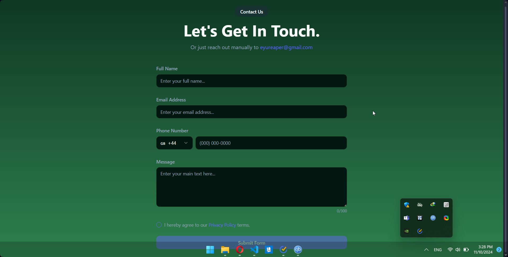

# Contact Form Application

A modern, responsive contact form application built with React and Supabase backend integration. This application allows users to submit contact information securely while providing administrators with access to view submissions.

## preview


## Features

- Clean and responsive design
- Real-time form validation
- Secure data storage with Supabase
- Row Level Security (RLS) policies for data protection
- International phone number support
- Toast notifications for form submission status

## Tech Stack

- **Frontend:**
  - React
  - TypeScript
  - Tailwind CSS
  - shadcn/ui components
  - React Query for data management

- **Backend:**
  - Supabase for data storage
  - Row Level Security (RLS) policies
  - Secure API endpoints

## Getting Started

1. Clone the repository
2. Install dependencies:
```bash
npm install
```
3. Start the development server:
```bash
npm run dev
```

## Environment Variables

Create a `.env` file in the root directory with your Supabase credentials:

```env
VITE_SUPABASE_URL=your_supabase_url
VITE_SUPABASE_ANON_KEY=your_supabase_anon_key
```

## Security

The application implements the following security measures:

- Public users can submit contact forms
- Only authenticated administrators can view submissions
- Updates and deletions are prevented through RLS policies
- Form data is validated both client and server-side

## Contact Form Fields

- Full Name
- Email Address
- Phone Number (with country code selection)
- Message (limited to 300 characters)
- Privacy Policy acceptance

## Contributing

1. Fork the repository
2. Create your feature branch (`git checkout -b feature/AmazingFeature`)
3. Commit your changes (`git commit -m 'Add some AmazingFeature'`)
4. Push to the branch (`git push origin feature/AmazingFeature`)
5. Open a Pull Request

## License

This project is licensed under the MIT License - see the LICENSE file for details.
